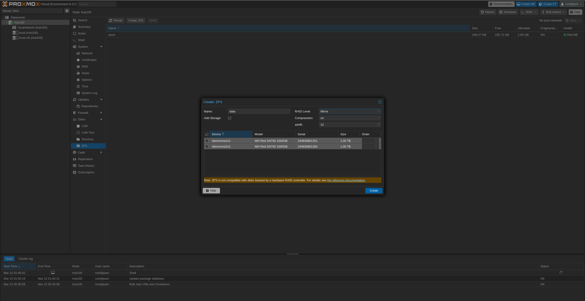
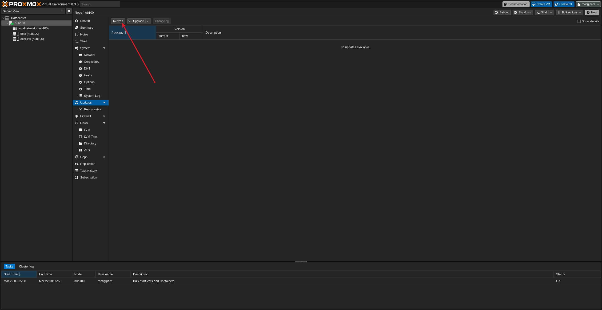

# proxmox-setup
Setting up proxmox on bare metal. Describes preliminary actions, setting up the cluster nodes and best practices right after

## Target audience and version

This guide is for guide for Setting up Proxmox VE 8.3.5 on bare metal.

# Preliminary actions

## 1. Download the ISO image and create a bootable USB

Head to the [Proxmox VE](https://www.proxmox.com/en/downloads/proxmox-virtual-environment/iso) website and download the latest ISO image.

Then, create a bootable USB using linux command line tools.

Check the device name of the USB drive using `lsblk` or `fdisk -l`.

e.g. 

> fdisk -l

yields

```sh
Disk /dev/sda: 14.53 GiB, 15597568000 bytes, 30464000 sectors
Disk model: Ultra           
Units: sectors of 1 * 512 = 512 bytes
Sector size (logical/physical): 512 bytes / 512 bytes
I/O size (minimum/optimal): 512 bytes / 512 bytes
Disklabel type: dos
Disk identifier: 0x00000000
```
replace *sdX* with the device name of the USB drive.

```bash
sudo dd if=/path/to/proxmox-ve.iso of=/dev/sdX bs=4M status=progress && sync
```

## 2. Install Proxmox VE on the target machines

Make sure the target machines are booted from the bootable USB and boot from the USB drive.

Aim for graphical installation. 
Confirm the EULA.

### Choosing the volume

Choose the volume to install Proxmox VE. We will use the entire disk for the installation and opt for ZFS.

The ratio for ZFS is to be able to create a snapshot of the root volume.

Always use different storage devices for the installation and for the virtual machines. This allows us to redo the installation without losing the virtual machines.zu

### ZFS Options for the root volume

Make sure to use a ashift value of as per the block size of the storage device, otherwise we end up with write amplification and our disks will wear out faster.

### Addtional options

- use a network interface for the management network you are not using for the communication between the nodes nor between the nodes and the outside world.

# First steps on the Proxmox VE

1. Disable enterprise subscription check

In the proxmox web interface, go to your node and the click on Updates->Repositories.

Disable the following repositories:

- enterprise.proxmox.com/debian/pve
- enterprise.proxmox.com/debian/ceph-quincy
Now head Updates and click *Refesh* in the toolbar.

**Bash version**


```bash
echo "Getting rid of the the enterprise repositories"
cd /etc/apt/
cp sources.list sources.list.bak
echo "deb http://ftp.ch.debian.org/debian bookworm main contrib

deb http://ftp.ch.debian.org/debian bookworm-updates main contrib

# security updates
deb http://security.debian.org bookworm-security main contrib

deb http://download.proxmox.com/debian/pve bookworm pve-no-subscription" > sources.list

chmod 644 sources.list

echo "Getting rid of the enterprise ceph repositories"
cd /etc/apt/sources.list.d
cp ceph.list ceph.list.bak
echo "# deb https://enterprise.proxmox.com/debian/ceph-quincy bookworm enterprise

deb http://download.proxmox.com/debian/ceph-quincy bookworm no-subscription
" > ceph.list
chmod 644 ceph.list

cp pve-enterprise.list pve-enterprise.list.bak

echo "# deb https://enterprise.proxmox.com/debian/pve bookworm pve-enterprise
" > pve-enterprise.list
chmod 644 pve-enterprise.list

apt-get update
apt-get upgrade


```

# 2. Hardening the Proxmox VE

## 2.1. Setup sshd to only pubkey authentication for non-root users

1. Become root
2. Create a new user on the proxmox 

```bash
USER=gix && useradd -d /home/$USER -c "$USER vlic anonymous" $USER && mkdir -p /home/$USER/.ssh && touch /home/$USER/.ssh/authorized_keys && chown -R $USER /home/$USER
```

3. Add the public key to the authorized_keys file

```bash
USER=gix && echo "ssh-rsa AAAAB3NzaC1yc2EAAAADAQABAAABgQDJ+1234567890" >> /home/$USER/.ssh/authorized_keys
```

Repeat for all users you want to allow.

4. Setup sshd

run the following script

```bash
#!/bin/bash

# Define the SSH config file path
SSH_CONFIG="/etc/ssh/sshd_config"

# Create a timestamped backup
TIMESTAMP=$(date +"%Y%m%d_%H%M%S")
BACKUP_FILE="${SSH_CONFIG}.backup.${TIMESTAMP}"

echo "Creating backup of SSH config at ${BACKUP_FILE}"
cp "${SSH_CONFIG}" "${BACKUP_FILE}"

# Check if backup was successful
if [ ! -f "${BACKUP_FILE}" ]; then
  echo "Error: Failed to create backup file. Aborting."
  exit 1
fi

echo "Modifying SSH configuration..."

# Create a temporary file for the new configuration
TMP_FILE=$(mktemp)

# Get original permissions to preserve them
ORIGINAL_PERMS=$(stat -c "%a" "${SSH_CONFIG}")

# First, change PermitRootLogin from yes to no
sed 's/^PermitRootLogin yes/PermitRootLogin no/' "${SSH_CONFIG}" > "${TMP_FILE}"

# Now add or update all the security options
cat > "${TMP_FILE}" << EOF
# SSH Configuration modified on $(date)
# Original file backed up at ${BACKUP_FILE}

Port 22
Protocol 2
AllowUsers gix
LoginGraceTime 2m
PermitRootLogin no
StrictModes yes
MaxAuthTries 1
PubkeyAuthentication yes
AuthorizedKeysFile %h/.ssh/authorized_keys
RhostsRSAAuthentication no
PasswordAuthentication no
PermitEmptyPasswords no
UsePAM yes

# Preserving original configuration below
$(grep -v "^Port\|^Protocol\|^AllowUsers\|^LoginGraceTime\|^PermitRootLogin\|^StrictModes\|^MaxAuthTries\|^PubkeyAuthentication\|^AuthorizedKeysFile\|^RhostsRSAAuthentication\|^PasswordAuthentication\|^PermitEmptyPasswords\|^UsePAM" "${SSH_CONFIG}")
EOF

# Apply the changes
mv "${TMP_FILE}" "${SSH_CONFIG}"

# Restore original permissions
chmod "${ORIGINAL_PERMS}" "${SSH_CONFIG}"

echo "SSH configuration updated successfully."

# Validate the configuration
echo "Validating SSH configuration..."
sshd -t
if [ $? -ne 0 ]; then
  echo "Error: SSH configuration is invalid. Restoring backup..."
  cp "${BACKUP_FILE}" "${SSH_CONFIG}"
  chmod "${ORIGINAL_PERMS}" "${SSH_CONFIG}"
  echo "Backup restored. Please check your configuration manually."
  exit 1
fi

# Reload SSH daemon
echo "Reloading SSH daemon..."
/etc/init.d/ssh reload

echo "SSH configuration has been updated and service reloaded."
echo "IMPORTANT: Make sure you have another way to access the system before logging out!"
echo "After logging in, you can switch to root using: su -"
```

### Set bash as std shell

> chsh -s /bin/bash lambdaroyal-anon


2. Create a ZFS pool **data**




## 2. Create a virtual machine

## 3. Install the OS

## 4. Install proxmox

## 5. Install the cluster nodes


## 6. Deploy containerized services

### 6.1. Important configuration invariants

- set proper network bridge for the container
- set manual IP for the container
- set the gateway the host is using as well

#### Restrict ssh access to the container

using TCP Wrapper

```bash
apt-get install libnss-wrapper
```

/etc/hosts.allow

```bash
# /etc/hosts.allow: list of hosts that are allowed to access the system.
#                   See the manual pages hosts_access(5) and hosts_options(5).
#
# Example:    ALL: LOCAL @some_netgroup
#             ALL: .foobar.edu EXCEPT terminalserver.foobar.edu
#
# If you're going to protect the portmapper use the name "rpcbind" for the
# daemon name. See rpcbind(8) and rpc.mountd(8) for further information.
#
sshd: 192.168.1.100
sshd: 116.203.216.1
sshd: 192.168.1.0/24
sshd: 5.161.184.133
```

/etc/hosts.deny  

```bash
sshd: ALL
```


 Allow SSH access only from specific subnet

```bash
Match Address 192.168.1.0/24
    PermitRootLogin no
    PasswordAuthentication no
    PubkeyAuthentication yes
```


